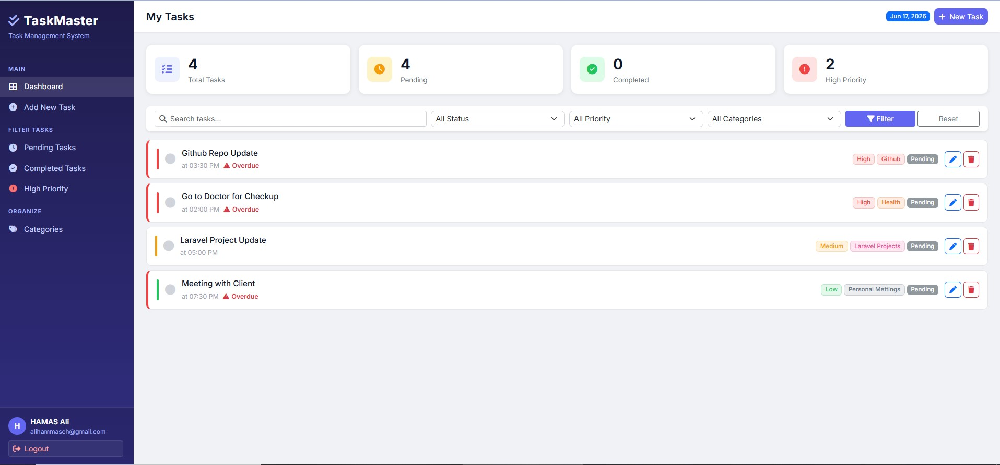
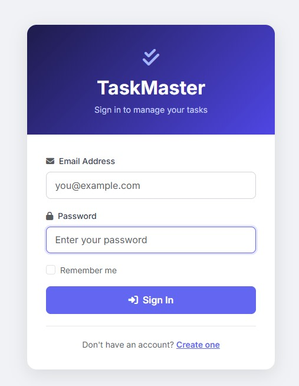
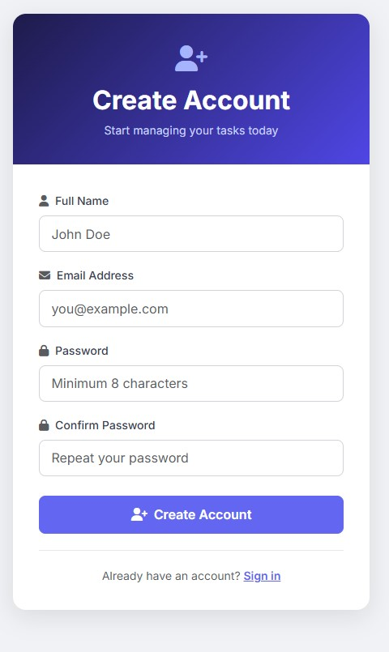
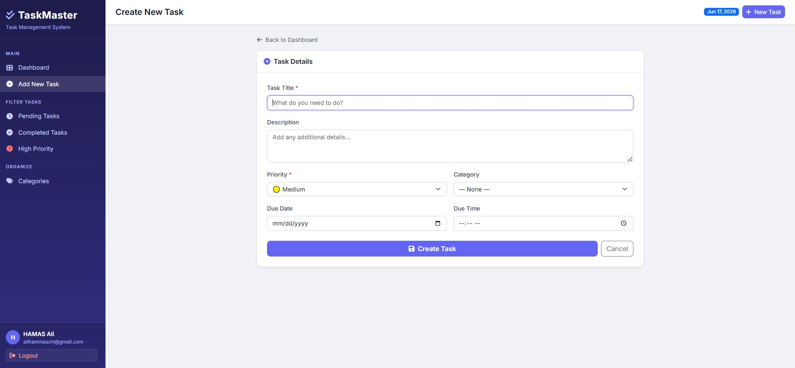
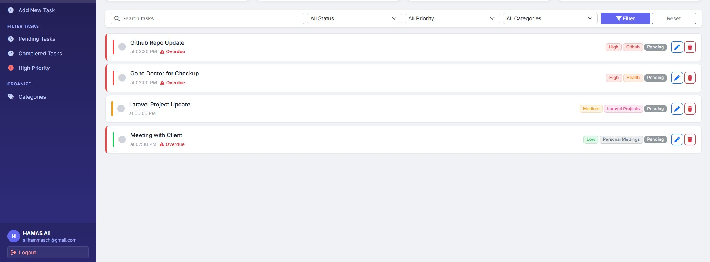
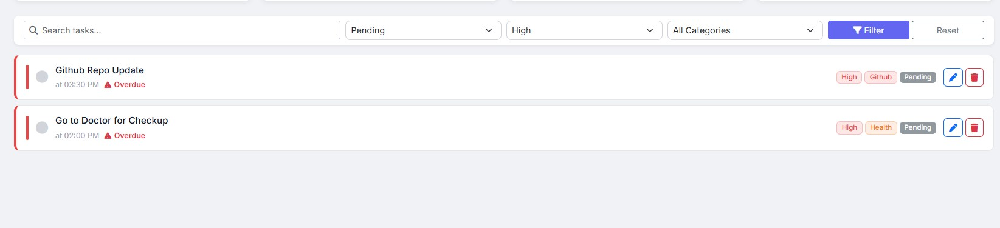
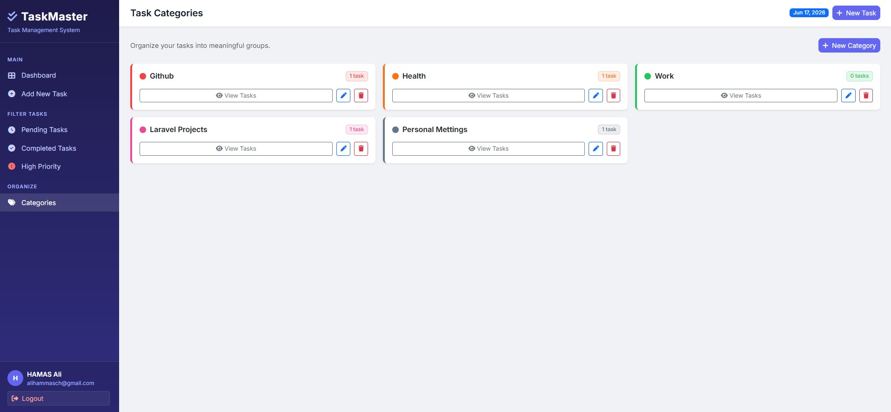
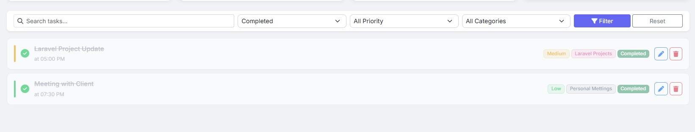

<div align="center">

<br />


<br />
<br />

# 📝 TaskMaster - To-Do List Web Application

**A clean, full-featured task management application built with Laravel — organize your life, one task at a time.**

<br />

[](https://php.net)
[](https://laravel.com)
[]
[](https://tailwindcss.com)
[](LICENSE)
[](../../pulls)


</div>

---

## 📚 Table of Contents

- [Overview](#-overview)
- [Key Features](#-key-features)
- [Screenshots](#-screenshots)
- [Tech Stack](#-tech-stack)
- [Project Structure](#-project-structure)
- [Getting Started](#-getting-started)
- [Environment Variables](#-environment-variables)
- [Database Schema](#-database-schema)
- [Roadmap](#-roadmap)
- [Contributing](#-contributing)
- [License](#-license)
- [Contact](#-contact)

---

## 🔍 Overview

**Laravel To-Do** is a productivity-first task management web application designed to help individuals and teams organize tasks efficiently. It features full CRUD operations, user authentication, priority management, category organization, and a real-time dashboard — all wrapped in a clean, responsive interface.

> Built as a demonstration of modern Laravel best practices including Eloquent ORM, Blade templating, form validation, middleware-protected routes, and RESTful resource controllers.

---

## ✨ Key Features

<table>
  <thead>
    <tr>
      <th>Category</th>
      <th>Feature</th>
      <th>Description</th>
    </tr>
  </thead>
  <tbody>
    <tr>
      <td rowspan="3"><strong>🔐 Auth</strong></td>
      <td>Registration</td>
      <td>Create a new account with name, email, and password</td>
    </tr>
    <tr>
      <td>Login / Logout</td>
      <td>Secure session-based authentication</td>
    </tr>
    <tr>
      <td>Profile Management</td>
      <td>Update personal info and avatar</td>
    </tr>
    <tr>
      <td rowspan="4"><strong>📋 Tasks</strong></td>
      <td>Create Task</td>
      <td>Add tasks with title, description, category, priority, and due date</td>
    </tr>
    <tr>
      <td>Edit Task</td>
      <td>Modify any task attribute at any time</td>
    </tr>
    <tr>
      <td>Delete Task</td>
      <td>Remove tasks individually or perform bulk deletion</td>
    </tr>
    <tr>
      <td>Toggle Complete</td>
      <td>Mark tasks as done or pending with one click</td>
    </tr>
    <tr>
      <td rowspan="3"><strong>🏷️ Organization</strong></td>
      <td>Categories</td>
      <td>Create and manage custom categories (Work, Personal, etc.)</td>
    </tr>
    <tr>
      <td>Priority Levels</td>
      <td>Assign Low, Medium, or High priority to each task</td>
    </tr>
    <tr>
      <td>Due Dates</td>
      <td>Set deadlines with visual overdue indicators</td>
    </tr>
    <tr>
      <td rowspan="3"><strong>🔎 Productivity</strong></td>
      <td>Search</td>
      <td>Instantly find tasks by keyword</td>
    </tr>
    <tr>
      <td>Filter & Sort</td>
      <td>Filter by status, priority, or category; sort by date or name</td>
    </tr>
    <tr>
      <td>Dashboard Stats</td>
      <td>Visual summary of total, completed, pending, and overdue tasks</td>
    </tr>
    <tr>
      <td><strong>📱 UI/UX</strong></td>
      <td>Responsive Design</td>
      <td>Optimized for desktop, tablet, and mobile browsers</td>
    </tr>
  </tbody>
</table>

---

## 📸 Screenshots

<br />

### 🏠 Dashboard
> A high-level summary of your productivity — total tasks, completed, pending, and overdue counts.



<br />

---

### 🔐 Login & Registration
> Secure, minimal authentication screens for sign-in and account creation.

| Login | Register |
|-------|----------|
|  |  |

<br />

---

### ➕ Create & Edit Task
> Intuitive form to add or update a task with all relevant metadata.



<br />

---

### 📋 Task List
> View all your tasks in a clean list with inline actions (complete, edit, delete).



<br />

---

### 🔍 Search & Filter
> Locate tasks instantly by keyword or narrow results by category, priority, or status.



<br />

---

### 🏷️ Categories
> Create, rename, and manage your own task categories.



<br />

---

### ✅ Completed Tasks
> Completed tasks are visually distinguished, giving you a clear sense of progress.



<br />

---


---

## 🛠 Tech Stack

### Backend
| Technology | Version | Purpose |
|---|---|---|
| [PHP](https://php.net) | 8.4+ | Core language |
| [Laravel](https://laravel.com) | 13.x | Application framework |
| [MySQL](https://mysql.com) | 8.0 | Relational database |
| [Eloquent ORM](https://laravel.com/docs/eloquent) | — | Database abstraction layer |
| [Laravel Sanctum](https://laravel.com/docs/sanctum) | — | API token authentication |

### Frontend
| Technology | Version | Purpose |
|---|---|---|
| [Blade](https://laravel.com/docs/blade) | — | Server-side templating |
| [Tailwind CSS](https://tailwindcss.com) | 3.x | Utility-first CSS framework |
| [Alpine.js](https://alpinejs.dev) | 3.x | Lightweight reactive JS |
| [Vite](https://vitejs.dev) | 5.x | Frontend asset bundler |

### Dev & Tooling
| Tool | Purpose |
|---|---|
| [Composer](https://getcomposer.org) | PHP package manager |
| [npm](https://npmjs.com) | Node package manager |
| [Laravel Debugbar](https://github.com/barryvdh/laravel-debugbar) | Development debugging |
| [PHPUnit](https://phpunit.de) | Unit & feature testing |

---

## 📁 Project Structure

```
laravel-todo-app/
├── app/
│   ├── Http/
│   │   ├── Controllers/          # TaskController, CategoryController, ProfileController
│   │   └── Middleware/           # Auth & route protection
│   └── Models/                   # User, Task, Category Eloquent models
├── database/
│   ├── migrations/               # DB schema definitions
│   └── seeders/                  # Sample data seeders
├── resources/
│   ├── views/
│   │   ├── auth/                 # Login, register templates
│   │   ├── tasks/                # Task CRUD views
│   │   ├── categories/           # Category management views
│   │   └── layouts/              # App shell & nav
│   └── js/ & css/                # Frontend assets (Tailwind + Alpine)
├── routes/
│   └── web.php                   # All application routes
├── screenshots/                  # README screenshots
├── .env.example
├── composer.json
└── package.json
```

---

## 🚀 Getting Started

### Prerequisites

Ensure the following are installed on your machine:

- **PHP** >= 8.4 with extensions: `mbstring`, `pdo_mysql`, `xml`, `curl`
- **Composer** >= 3.x
- **Node.js** >= 18 & **npm** >= 9
- **MySQL** >= 8.0
- **Git**

---

### Installation

**1. Clone the repository**

```bash
git clone https://github.com/hamasali111/laravel-todo-app.git
cd laravel-todo-app
```

**2. Install PHP dependencies**

```bash
composer install
```

**3. Install Node dependencies**

```bash
npm install
```

**4. Set up environment file**

```bash
cp .env.example .env
```

**5. Configure your database in `.env`**

```env
DB_CONNECTION=mysql/sqlite
DB_HOST=127.0.0.1
DB_PORT=3306
DB_DATABASE=laravel_todo
DB_USERNAME=root
DB_PASSWORD=your_password
```

**6. Generate application key**

```bash
php artisan key:generate
```

**7. Run database migrations**

```bash
php artisan migrate
```

**8. Seed sample data** *(optional)*

```bash
php artisan db:seed
```

**9. Build frontend assets**

```bash
npm run build
```

**10. Start the development server**

```bash
php artisan serve
```

🎉 Open your browser and navigate to **[http://localhost:8000](http://localhost:8000)**

---

## ⚙️ Environment Variables

| Variable | Default | Description |
|---|---|---|
| `APP_NAME` | `Laravel` | Application display name |
| `APP_ENV` | `local` | Application environment (`local`, `production`) |
| `APP_KEY` | *(generated)* | Application encryption key |
| `APP_DEBUG` | `true` | Enable debug mode (set `false` in production) |
| `APP_URL` | `http://localhost` | Base application URL |
| `DB_CONNECTION` | `mysql` | Database driver |
| `DB_HOST` | `127.0.0.1` | Database host |
| `DB_PORT` | `3306` | Database port |
| `DB_DATABASE` | `laravel_todo` | Database name |
| `DB_USERNAME` | `root` | Database username |
| `DB_PASSWORD` | *(empty)* | Database password |
| `SESSION_DRIVER` | `file` | Session storage driver |

---

## 🗄 Database Schema

```
┌──────────────────────────────┐
│            users             │
├──────────────────────────────┤
│ id              BIGINT (PK)  │
│ name            VARCHAR      │
│ email           VARCHAR      │
│ password        VARCHAR      │
│ avatar          VARCHAR NULL │
│ created_at      TIMESTAMP    │
│ updated_at      TIMESTAMP    │
└──────────────┬───────────────┘
               │ 1:N
               │
┌──────────────▼───────────────┐       ┌──────────────────────────────┐
│          categories          │       │            tasks             │
├──────────────────────────────┤       ├──────────────────────────────┤
│ id              BIGINT (PK)  │◄──1:N─┤ id              BIGINT (PK)  │
│ user_id         BIGINT (FK)  │       │ user_id         BIGINT (FK)  │
│ name            VARCHAR      │       │ category_id     BIGINT (FK)  │
│ created_at      TIMESTAMP    │       │ title           VARCHAR      │
│ updated_at      TIMESTAMP    │       │ description     TEXT NULL    │
└──────────────────────────────┘       │ priority        ENUM         │
                                       │ status          ENUM         │
                                       │ due_date        DATE NULL    │
                                       │ created_at      TIMESTAMP    │
                                       │ updated_at      TIMESTAMP    │
                                       └──────────────────────────────┘

priority: 'low' | 'medium' | 'high'
status:   'pending' | 'completed'
```

---

## 🗺 Roadmap

- [x] User authentication (register, login, logout)
- [x] Full CRUD for tasks and categories
- [x] Priority levels and due dates
- [x] Search, filter, and sort
- [x] Responsive UI
- [ ] Email reminders for overdue tasks
- [ ] Drag-and-drop task reordering
- [ ] Dark mode support
- [ ] REST API with token authentication
- [ ] Team / shared task boards
- [ ] Mobile app (React Native)

---

## 🤝 Contributing

Contributions make the open-source community an amazing place to learn and create. Any contributions you make are **greatly appreciated**.

1. **Fork** the repository
2. **Create** your feature branch

   ```bash
   git checkout -b feature/AmazingFeature
   ```

3. **Commit** your changes

   ```bash
   git commit -m 'feat: add AmazingFeature'
   ```

4. **Push** to your branch

   ```bash
   git push origin feature/AmazingFeature
   ```

5. **Open** a Pull Request

> Please follow [PSR-12](https://www.php-fig.org/psr/psr-12/) coding standards and write appropriate tests for new features.

---

## 📄 License

Distributed under the **MIT License**. See [`LICENSE`](LICENSE) for full details.

---


<div align="center">

⭐ **If this project helped you, please give it a star!** ⭐

</div>
